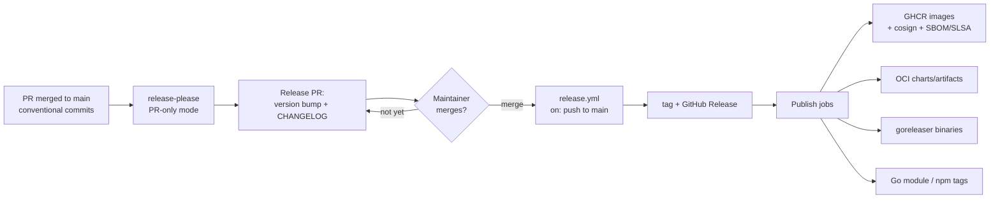

# Release process

This page is the **documentation of record** for how releases work across every repo in the 7K-Inari org. It covers the automated flow, the per-repo configuration, what you need to do as a contributor, and runbooks for when things go wrong.

The process is recorded as a decision in [ADR-0002](../adr/0002-release-automation-release-please.md).

## The flow

Every 7K-Inari repo releases the same way:

1. **Merge conventional commits to `main`.** Every PR that lands on `main` uses [Conventional Commits](https://www.conventionalcommits.org/) (squash-merge with a conventional title). See [Commit message rules](#commit-message-rules).
2. **release-please proposes a Release PR.** A workflow running [release-please](https://github.com/googleapis/release-please) in **PR-only mode** (`skip-github-release: true`) watches `main`. On each push it opens or updates a *Release PR* containing a version bump and a CHANGELOG diff computed from the conventional commits since the last release. It **never** creates tags, **never** creates GitHub Releases, and **never** triggers CI/publish pipelines.
3. **A maintainer merges the Release PR.** This is the only manual step, and it is the release gate: merging the Release PR *is* cutting the release. Review the proposed version and CHANGELOG before merging.
4. **`release.yml` publishes.** A workflow named `release.yml`, triggered `on: push` to `main`, detects the release merge (the release-please version-bump commit) and:
   - creates the git **tag** and the **GitHub Release** (with the CHANGELOG notes), then
   - runs the **publish jobs** — GHCR container images with cosign signatures + SBOM/SLSA provenance, OCI Helm charts/artifacts, goreleaser binaries, Go module and npm tags — either directly or via reusable workflows (`workflow_call`).



### Why publish jobs live in `release.yml`

Tags and releases created inside a workflow run using the default `GITHUB_TOKEN` **do not fire downstream workflow triggers**. This is a deliberate GitHub anti-recursion rule: events produced by `GITHUB_TOKEN` never start new workflow runs. If `release.yml` created the `v1.2.3` tag and stopped, a separate `on: push: tags: [v*]` publish workflow would simply never run.

Therefore the workflow that creates the tag must also run the publish jobs — directly, or by invoking reusable workflows via `workflow_call` (a `workflow_call` runs inside the *same* workflow run, so it is not affected by the rule). Do not split publishing into tag-triggered workflows unless tag creation is moved to a bot PAT/GitHub App token, which we deliberately avoid (see ADR-0002).

## Per-repo configuration

release-please is configured per repo via `release-please-config.json` + `.release-please-manifest.json`. The `release-type` and publish outputs differ per repo:

| Repo | release-type | Versioned artifact(s) | Publish outputs |
|---|---|---|---|
| `inari-server` | `go` | Container image `inari/server` | GHCR image + cosign + SBOM/SLSA |
| `inari-agent` | `go` | Container image `inari/agent` + install manifests | GHCR image + cosign + SBOM/SLSA |
| `inari-operator` | `go` | Container image `inari/operator` | GHCR image + cosign + SBOM/SLSA |
| `inari-ui` | `node` | Static bundle (served by `inari-server`) | versioned bundle artifact |
| `inari-api` | `go` | Contract packages (protobuf/OpenAPI, generated clients) | Go module tag `vX.Y.Z` |
| `inari-plugin-sdk` | `go` | Go module | Go module tag `vX.Y.Z` |
| `inari-ui-plugin-sdk` | `node` | npm package | npm publish + dist-tag |
| `inari-catalog` | `simple` (per-package paths) | OCI artifacts + channels | OCI artifacts to GHCR + channel tags (see below) |
| `inari-cli` | `go` | Binaries | goreleaser: archives, brew/scoop, `go install` tag |
| `inari-helm-charts` | `helm` (per-chart packages) | Charts (OCI) | OCI chart push to GHCR (see below) |
| `inari-ext-argocd` | `go` | Container image + UI remote | GHCR image + cosign + SBOM/SLSA |
| `inari-docs` | — | Static site | **No releases** — deployed continuously to GitHub Pages |

### inari-helm-charts: per-chart scheme

Charts version **independently**. The repo uses one release-please config with a separate package entry per chart path (e.g. `charts/inari-server`, `charts/inari-agent`, `charts/platform-baseline`), each with `release-type: helm`.

- Tags are per chart: **`<chart-name>-<version>`** (e.g. `inari-server-0.4.0`).
- The Release PR bumps each changed chart's `version` in its `Chart.yaml` and updates the per-chart CHANGELOG; only charts with releasable commits get bumped.
- On merge, `release.yml` creates the per-chart tags and pushes each changed chart as an OCI artifact to GHCR (`oci://ghcr.io/7k-inari/charts/<chart-name>`).

### inari-catalog: per-package tag scheme

The catalog is a content monorepo (KRO RGDs, platform-app charts, policy packs) with its own, faster cadence.

- release-please runs with a package entry per package directory; tags follow the monorepo scheme **`<package-path>/v<version>`** (e.g. `packages/postgres/v1.3.0`).
- On merge, `release.yml` pushes the changed packages as signed OCI artifacts to GHCR and updates the moving **channel tags** (`stable`, `incubating`) for packages whose channel changed.
- Channel membership is metadata in the package, not a git tag — moving a package between channels is a normal conventional commit.

## Contributor guide

### Commit message rules

All commits landing on `main` must follow [Conventional Commits](https://www.conventionalcommits.org/):

```
<type>(<optional scope>)<!>: <description>

<optional body>

<optional footers>
```

Common types: `feat`, `fix`, `perf`, `refactor`, `docs`, `chore`, `ci`, `test`, `build`. PRs are squash-merged — make the **PR title** the conventional commit message.

### Version proposal semantics

release-please computes the next version from commit types since the last tag:

| Commit | Effect on proposed version |
|---|---|
| `feat:` | **minor** bump (e.g. 1.2.3 → 1.3.0) |
| `fix:`, `perf:` | **patch** bump (1.2.3 → 1.2.4) |
| `feat!:` / `fix!:` / any type with `!` or a `BREAKING CHANGE:` footer | **major** bump (1.2.3 → 2.0.0) |
| `docs:`, `chore:`, `ci:`, `test:`, `refactor:` (non-breaking) | no release by themselves |
| `Release-As: X.Y.Z` footer | forces the proposed version to `X.Y.Z` |

Pre-1.0 repos: majors become minors and minors become patches per release-please's bump-minor-pre-major / bump-patch-for-minor-pre-major behavior.

### Cutting a release

1. Check the open **Release PR** (titled like `chore(main): release 1.3.0`) in the repo. It refreshes automatically as commits land.
2. Review the proposed version and CHANGELOG. To change the version, push an empty commit with a `Release-As:` footer to `main`.
3. **Merge the Release PR.** That is the release.
4. Watch the `release.yml` run: it creates the tag + GitHub Release and publishes the artifacts.

### Hotfix

1. Land the fix on `main` as a normal PR with a `fix:` (or `fix!:` if breaking) conventional title.
2. release-please adds it to the open Release PR (patch bump) — or opens one if none exists.
3. Merge the Release PR. No special branching; releases are always cut from `main`.

### Skipping a release

- **Don't merge the Release PR.** Nothing publishes until it merges; it simply accumulates more commits.
- To discard a proposal entirely, close the Release PR and delete its branch — release-please will re-propose from scratch when the next releasable commit lands.
- To keep commits out of any release notes/version math, use non-releasing types (`docs:`, `chore:`, `ci:`) for them.

## Runbook

### `release.yml` failed after the Release PR merged

1. Open the failed run and identify which step failed: tag/release creation, or a publish job.
2. **If the tag was not created:** fix the cause, then re-run the failed workflow from the Actions tab (*Re-run failed jobs*). The workflow is idempotent — it re-detects the release merge and creates the tag.
3. **If the tag was created but a publish job failed:** either re-run failed jobs (preferred), or delete the tag and GitHub Release (`git push origin :refs/tags/vX.Y.Z` + delete the release in the UI) and re-run the whole workflow to recreate both.
4. If the failure is systemic (registry outage, expired token), fix it first — re-running against the same broken condition just fails again. See *Rotating tokens* for credential issues.

### Reverting a release

Published artifacts are **not deleted** — images, charts, and npm versions already consumed by users stay available. Reverting means superseding:

1. `git revert` the offending change(s) on a branch; open a PR titled `fix: revert <change>` (or `fix!:` if the revert itself breaks compat).
2. Merge it; release-please proposes a new patch/minor release containing the revert.
3. Merge the new Release PR. Users upgrade forward to the fixed version.
4. If an artifact is actively harmful (e.g. leaked secret), additionally delete the specific GHCR package version / mark the npm version deprecated, and note it in the GitHub Release.

Do **not** revert the release-please bump commit itself to "unrelease" — the tag and artifacts already exist; history and reality would diverge.

### Rotating tokens

- Publish jobs use the workflow's `GITHUB_TOKEN` for GHCR, tags, and releases — no rotation needed beyond the repo's `permissions:` blocks.
- Any repo that needs a PAT or GitHub App token (e.g. cross-repo pushes) stores it as an **org or repo Actions secret** (see the repo's `release.yml` `secrets:` references for exact names).
- Rotation: generate the new token with the same scopes → update the secret value in GitHub → re-run the most recent failed `release.yml` job to confirm → revoke the old token.
- After rotating, check the next scheduled workflow run (if any) — secret updates do not retroactively fix queued runs.

## See also

- [ADR-0002: Release automation via release-please](../adr/0002-release-automation-release-please.md)
- [Platform plan §5.10 — Security model summary](../architecture/inari-platform-plan.md#510-security-model-summary) (supply-chain requirements)
- [Platform plan §6 — Repository topology](../architecture/inari-platform-plan.md#6-repository-topology)
