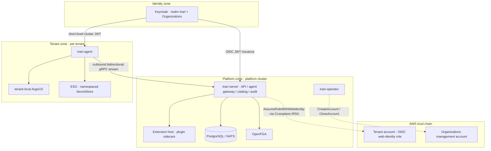

# Threat Model

**Document type:** Security review artifact (M4)
**Audience:** Platform engineering, security reviewers, tenant security teams
**Status:** v1.0 · feeds the M4 security review
**Source:** [Inari platform plan](../architecture/inari-platform-plan.md) §4.2, §5.10, §10, §12.2/10

This document applies STRIDE to each of Inari's trust zones. It records the threats we have identified, the mitigations built into v1.0, and the residual risks we accept or defer. It is the input to the M4 security review and the baseline for future reviews.

:::warning Penetration testing
This threat model is a design-time review. A third-party **penetration test is required before Inari sells services** or runs production tenant workloads beyond pilot scope (plan §12.2/10, §12.3/13). The pen-test should exercise every trust boundary below, with special attention to the agent channel and the extension proxy path.
:::

## Trust zones

Inari is a hub-and-spoke control plane with four trust zones (plan §4.2). Every trust boundary crossing is enumerated below.

Boundary crossings:

| # | Crossing | Mechanism |
|---|---|---|
| B1 | User → platform (console/CLI/API) | OIDC JWT from Keycloak, per-service audiences, OpenFGA checks |
| B2 | Agent → agent gateway | Outbound-only gRPC stream, short-lived per-cluster JWT with hardcoded `cluster_id` |
| B3 | Registration bootstrap | One-time, TTL'd registration token exchanged for a per-cluster OIDC client |
| B4 | Platform → tenant AWS account | `AssumeRoleWithWebIdentity` against a least-privilege role trusting the platform cluster's OIDC issuer |
| B5 | Platform → AWS management account | Tenant Zone Factory only; role scoped to `organizations:CreateAccount/TagResource/DescribeCreateAccountStatus` (+ closure for decommission) |
| B6 | Plugin → control plane | go-plugin handshake (cookie, protocol version, checksum); plugin HTTP via authenticated reverse proxy `/api/extensions/<name>/*` |
| B7 | Tenant Git | GitHub App credentials delivered via ESO — never PATs, never in git |
| B8 | Automation → tenant clusters | Impersonation of tenant-scoped virtual users; audit records both identities |

## Zone 1 — Platform zone

`inari-server` (API gateway/BFF, agent gateway, catalog, orchestrator, audit, extension host, fleet manager, policy service), Keycloak, PostgreSQL/NATS, OpenFGA, `inari-operator`, plugin sidecars.

| STRIDE | Threat | v1.0 mitigation | Residual risk |
|---|---|---|---|
| **Spoofing** | Forged user/service identity | OIDC JWT validation at gateway; per-service `aud` client scopes block token reuse; Full Scope Allowed off on public clients | Compromised Keycloak admin — see EoP |
| **Tampering** | Mutation of control-plane state or desired state in tenant Git | All mutations flow as desired state (GitOps/CR-based); GitHub App auth via ESO; OCI-signed catalog artifacts (cosign) | Tenant Git repo compromise is a tenant-side boundary (Zone 3) |
| **Repudiation** | Actor denies an action | Immutable append-only audit log (outbox-written) for every action incl. impersonation and agent syncs; exportable | Audit volume growth; retention policy is operator-owned |
| **Info disclosure** | Cross-tenant data exposure | Keycloak Organizations isolation; OpenFGA ReBAC `Check`/`ListObjects` on every service route; per-tenant partitioning in cluster registry | OpenFGA dual-write drift — mitigated by outbox tuple writer + periodic reconciler + contract tests (plan §10) |
| **DoS** | API/gateway overload; agent-gateway flooding | Rate limits at the gateway; per-agent queues; modular monolith can scale horizontally | Large-tenant noisy-neighbor quotas are v1.x |
| **EoP** | Keycloak admin compromise → platform-wide control; plugin escape | Keycloak admin is break-glass, audited; plugins run as isolated sidecars with versioned gRPC contract and checksum verification; plugins inherit authn/authz via the proxy path (no raw credentials) | WASM sandbox for untrusted/tenant-supplied extensions is deferred (plan §5.8) |

## Zone 2 — Agent channel

The outbound-only bidirectional gRPC stream between `inari-agent` and the agent gateway (argocd-agent model), plus the registration bootstrap.

| STRIDE | Threat | v1.0 mitigation | Residual risk |
|---|---|---|---|
| **Spoofing** | Rogue cluster enrollment; agent impersonating another cluster | One-time TTL'd registration tokens (optionally double opt-in approval); identity from short-lived OIDC JWTs with **hardcoded `cluster_id` claim** — agent ID comes from the token claim, never self-asserted; revocation = disable the Keycloak client | mTLS/SPIFFE client certs are a v2 hardening option (plan §4.3) |
| **Tampering** | Command injection over the stream | Typed protobuf contract (`inari-api`) with contract CI; idempotent handlers; checksum-based resync | — |
| **Repudiation** | Cluster denies executing a command | Audit events for command dispatch and agent syncs | — |
| **Info disclosure** | Eavesdropping / proxy MITM | TLS on the stream; v1 documents HTTP/2 CONNECT proxy configuration for egress-only environments | Corporate TLS-inspecting proxies remain a risk: v1 documents the stance; WebSocket fallback and air-gapped operation are v2 (plan §5.3, §12.1/5) |
| **DoS** | Gateway exhaustion from stream churn | Backoff reconnect, ping/pong keepalive, per-agent queues; scale envelope tested at 50 concurrent streams with churn — see [load test report](../ops/load-test-v1.md) | — |
| **EoP** | Compromised agent pivots to control plane | Stream carries desired state only; control plane never holds kubeconfigs; agent RBAC is tenant-scoped and read-only for capability watches | — |

## Zone 3 — Tenant zone

The tenant's clusters (`inari-agent`, tenant-local ArgoCD, ESO, KRO, operators) and workloads.

| STRIDE | Threat | v1.0 mitigation | Residual risk |
|---|---|---|---|
| **Spoofing** | User bypassing console to hit the tenant API server directly | Structured JWT authentication (k8s `AuthenticationConfiguration`) trusts the platform Keycloak with CEL claim mapping (`organization` claim required); RBAC binds Keycloak groups to tenant ClusterRoles | Direct API access is *intended* (kubelogin); posture depends on tenant not weakening `AuthenticationConfiguration` |
| **Tampering** | Out-of-band mutation of Inari-managed resources | Desired state in platform-owned `<tenant>-inari-state` repo; drift detection (report-only in v1) surfaces divergence | Auto-remediation is v1.x — drift can persist until an operator acts |
| **Repudiation** | Tenant actor denies a change | Audit records real + impersonated identities; GitOps commit trail in tenant state repo | — |
| **Info disclosure** | Cross-tenant secret access via ESO | Namespaced `SecretStore` per tenant; backend policy scoped to tenant path prefix; admission policies block cross-tenant references | Governed `ClusterSecretStore` is platform-only |
| **DoS** | Resource exhaustion from oversized renders | Request-time OPA size ceilings and cost guardrails; render-time manifest checks | Cost-aware policies are v1.2 |
| **EoP** | Shared-namespace deletion wiping a co-tenant (Kratix postmortem) | **No shared tenant namespaces by default**; ownership semantics on `ResourceInstance`; teardown is ownership-checked; chaos/e2e tests for teardown (plan §10) | Tenants opting into shared namespaces accept the risk explicitly |

**Brownfield note:** every pre-existing resource found at registration is classified `adopt` / `observe-only` / `ignore`, with **observe-only the default** — nothing is mutated on first connect (plan §5.3).

## Zone 4 — AWS trust chain

OIDC web-identity federation from the platform cluster (and tenant clusters) into tenant AWS accounts, plus the management account used by the Tenant Zone Factory.

| STRIDE | Threat | v1.0 mitigation | Residual risk |
|---|---|---|---|
| **Spoofing** | Forged web-identity token; wrong-account assumption | Roles trust the cluster OIDC issuer, conditioned on `sub` (the Crossplane/agent service account) and `aud = sts.amazonaws.com`; optional `ExternalId`; validation = dry-run assume-role | — |
| **Tampering** | Privilege change on the onboarding role | Role is tenant-owned; bootstrap role is least-privilege (scoped to services Inari manages); tenant revokes by deleting the role | Inari cannot detect tenant-side role weakening — documented for tenants |
| **Repudiation** | Actions in AWS denied | CloudTrail baseline policy pack applied to vended zones; every Inari-side action audited | BYO accounts rely on tenant CloudTrail posture |
| **Info disclosure** | Cross-account resource visibility | Per-account Crossplane `ProviderConfig` pinned via `providerConfigRef` — tenant A's managed resources can only act in tenant A's account; **no long-lived keys stored on either side** | — |
| **DoS** | AWS Organizations quota exhaustion (CreateAccount/CloseAccount limits) | Quota pre-flight checks; resumable idempotent state machine; sub-resource status tracking; manual-intervention path (plan §10) | Zombie zones still possible under AWS-side failures — see [operator guide](../operator-guide/tenant-zones.md) |
| **EoP** | Management-account role abuse | `scope: management` CloudAccount allows *only* `organizations:CreateAccount/TagResource/DescribeCreateAccountStatus` + closure actions; zone vending is platform-engineer-only, approval- and policy-gated by default | — |

## Cross-cutting: supply chain

| Threat | Mitigation |
|---|---|
| Tampered catalog artifacts | OCI-signed artifacts (cosign); versioned channels `stable`/`incubating`; CI tests per package |
| Tampered plugin binaries | Checksum verification at handshake; versioned contract |
| Compromised release images | SLSA provenance on release images; cosign signatures |

## Data flows covered

1. **Registration flow** — token issuance → install manifest → token exchange → client secret via ESO → bootstrap token forgotten (B2, B3).
2. **Deploy flow** — request-time OPA → render → render-time checks → tenant Git → tenant-local ArgoCD → status stream back (B1, B2, B7).
3. **Zone-vending flow** — approval-gated request → `CreateAccount` → trust bootstrap → EKS → Inari wiring → Active (B5, B4, B3).
4. **Extension proxy flow** — authenticated request → RBAC `extensions, invoke, <name>` → header stripping → reverse proxy to plugin (B6).

## Review cadence

- This model is reviewed at every milestone exit gate and after any ADR that changes the security posture (see `CONTRIBUTING.md`).
- Deferred items and their triggers live in the plan §12.3 watchlist (mTLS/SPIFFE agent identity, WASM plugin sandbox, air-gapped operation, compliance/data-residency).
- Related M1 spike reports: [OpenFGA performance](../spikes/m1-openfga-performance.md), [KRO upgrade drill](../spikes/m1-kro-upgrade-drill.md), [ArgoCD bundle lifecycle](../spikes/m1-argocd-bundle-lifecycle.md).
